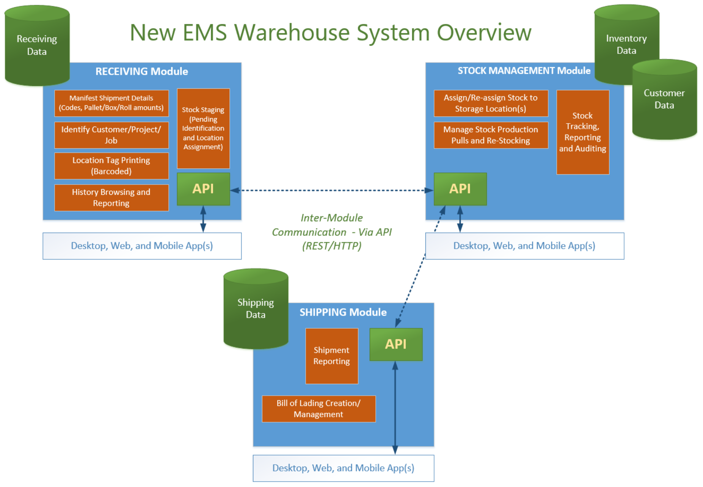

# wh-project
**New EMS Warehouse Inventory Management System Project**

This Repository is used to document the research and development work performed over the course of building and deploying a new *Warehouse Inventory Management System** (**wh**) for Executive Mailing Service.

## Overview:
Executive Mailing Service currently uses a pair of custom **ACCESS 97** Database applications (waresys.mdb & tracking.mdb) to manage mail-piece component inventory (Outer Envelopes, Forms, Inserts, Stickers, etc...).  The origins of these applications date back to the early years of the company (1980's).  It has served its purpose over the years but an overhaul/replacement of the system is desparately needed:

* The landscape of Direct Mail has changed dramatically in the last 15 years: Technology has become a much larger part of producing and managing Direct Mail campaigns and projects. Direct Mail service companys must be more agile and tech-savvy to meet the needs of today's Direct Mail client.  

* In the wake of the *"Great Recession"*, the client list for Executive Mailing Service has changed: Through the 90's and early 2000's, EMS served a small list of high-volume mailing clients, primarily from the financial sector (which have greatly reduced their mail volume and have consolidated vendors).  These mailing projects and related jobs were relatively simple, with few variations.  Around 2009, EMS began taking on more Non-Profit clients and mailing projects. Today's Direct Mail campaigns are typically much more complex.  With a significantly larger client base and more jobs in production, the unique number of stock components to manage increased greatly. With this increase, managing stock with current applications has become extremely problematic *(which is documented in the included workflow diagram, from a process review exercise)*.  With the large number of unique component codes to manage, there are often issues with lost and/or misplaced stock.  

There are some "off the shelf" solutions available. However, there is no money available to invest in any of them in the foreeable future.  Therefore, we are forced to address this issue by endevoring to develop a solution internally.  There are many viable and well supported Open-Source tools and frameworks available that can be used to build a modern Warehouse Inventory Management System that is customized to the EMS environment.

Below is an overview diagram of the system's genreral design:

The system consists of 3 Modules:
* **Receiving:** Automates and records activities associated with receiving stock into inventory
* **Stock Management:** Manages and tracks the location and usage of components
* **Shipping:** Automates and records activities associated with shipping inventory

The modules are interconnected and share information via an API (Http/REST).
